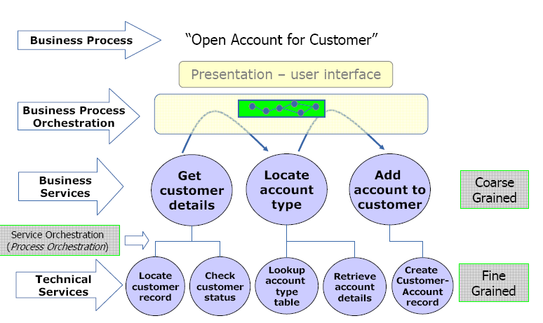
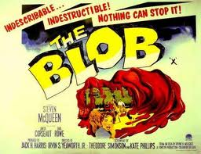
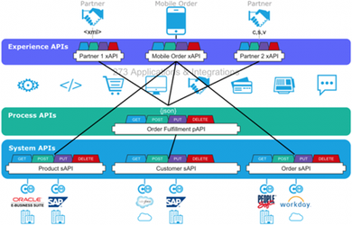
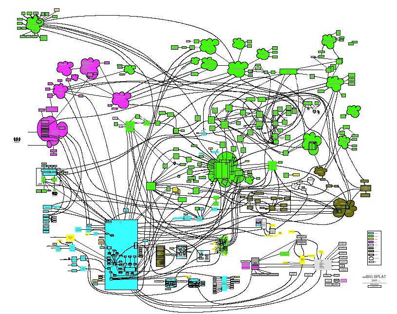
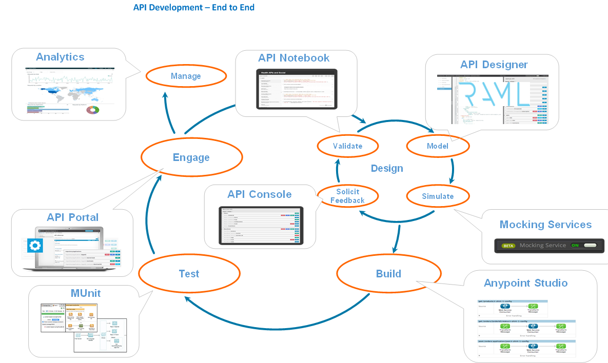

As part of VA's shift to digital solutions, VA has made a commitment to
leverage "API Solutions" as a fundamental approach to solving IT
problems. To provide the strategic direction of the VA, it is required
to define the key visionary aspects, hereby referred to as the VA API
Tenants. Within this document, we define the most important principles
of Integration and how they apply to VA context. Throughout the
document, there will be references to the VA API tenants, as well as
their supporting subcomponents, and how they're impacted by VA's people,
process, and technology. Below are the brief definitions of people,
process, and technology.

-   [People:]{.underline} The roles and responsibilities to build and
    maintain Integration Solutions.

-   [Process:]{.underline} Methodology and governance to build and
    maintain Integration Solutions

-   [Technology:]{.underline} Integration platforms and codified assets
    developed to connect

The API Developer Playbook currently is focused on "Technology" and the
associated accelerating "Processes". Future versions will include more
standards around "People" and more "Process".

[Technology:]{.underline}

API Solutions can be comprised of different technologies, platforms, and
IT components, ranging from API, queue, security, datastores, cloud
platform, and other key components on the typical "Microservices
Reference Architecture." It is important to understand the supporting
reference architecture, because API Solutions are rarely bundled into a
single platform, as well as API solutions have supporting capability
needs from other architecture components (for example: queuing, CICD,
Caching, etc.) Instead, a collection of best-of-breed technology
platforms are leveraged. Below is Visual Integrator's Integrator's
Reference Architecture, which maps all the archicture capabilities into
a Reference Architecture diagram, displaying the groupings,
relationships, and the API and supporting integration technology
responsibilities. Note, the diagram displays a complete Reference
Architecture capturing all possible capabilities, some of which may be
prioritized higher for VA teams. It is important to map which are most
important to enable the VA to produce agency and business solutions.

Figure 1: Visual Integrator Reference Architecture

{width="6.5in"
height="4.110416666666667in"}

*Reference Architecture Diagram Copyright Visual Integrator Consulting,
2003 - Current*

VA is committed to building solutions on API's to ensure a modern,
loosely coupled, scalable, and flexible approach to building
applications and data sharing.

Some of the key aspects of API's include:

-   -   Scalable

-   Flexible & Changeable

-   Adaptable

-   Secure

-   Well-Performing

-   Modernizable

<!-- -->

-   Re-Usable

-   Patterns

-   Frameworks

To accomplish, the Developer Playbook has an overview of the key API
tenants, so that developers understand the vision, purpose, and approach
towards leveraging API based solutions.

The VA API tenants include:

1.  Keep Total Cost of Ownership Low

2.  Leverage the VA API Marketplace (Portal and Catalog)

3.  Follow a Microservices Architecture

4.  API Solutions are fundamental to any VA Solution

5.  Archicture drives VA Solutions

6.  Follow Low Code approaches

Tenet \#1: Keep Total Cost of Ownership Low
===========================================

There are always multiple approaches to solving problems. In the IT
landscape, this could be in the magnitude of 50 different potential
approaches to solve a problem, especially when considering the number of
solution platforms, programming languages, and vendors with similar or
competitive offerings in the marketplace. Rationalizing the "best fit
solution" to solving a problem can be challenging, if not downright
cumbersome, when there are so many choices. Factoring in human factors
such as strong opinions, level of comfort, curiosity, personal
favoritism or biases, can make choosing a solution approach even more
challenging. Ultimately, choosing a solution approach should be based on
what is best for VA, when considering cost and overall benefit or value
derived from the selected approach.

For API the goal is to build or re-use existing integration assets as an
enabler for solutions across the entire VA Enterprise.

To accomplish this, the VA will follow approaches that invest in
architecture and supporting frameworks that can be re-used across API
Use Cases and solutions. Such frameworks and approaches are documented
in this API Playbook, and of course require an upfront investment to
reap the benefits downstream. As illustrated in the graphic, creating
the API Playbook, which includes foundational architecture and enabling
frameworks, allows for the VA to have the blueprints for building new
functionality and leveraging re-usable assets, ultimately making the
solutions operational and deriving value for the long haul.

Figure 2: Cost of Ownership Curve

{width="5.563478783902013in"
height="2.9166666666666665in"}

At times, there may be a simpler, less complex implementation approach
than the "standard API" approach, which seem faster or even less costly.
However, alternatives from the standard must be justified to determine
if they present long-term lower ownership costs. In other words, what
may seem simpler on the surface, may be costlier over long haul. This
especially holds true when measuring factors such as operations and
sustainment, change management, future solution modernization,
scalability, flexibility, and overall governance. The most common issue
is building a point-to-point or 1-off solution that is costlier of the
long haul to manage, maintain, and support---hence, a higher Total Cost
of Ownership.

Figure 3: TCO through API based Solutions

{width="6.5in"
height="3.8590846456692915in"}

To maintain low Total Cost of Ownership, the following principles shall
apply:

-   Leverage the standard API platforms, tools, and technologies,
    selected by VA and justify any exceptions to the standard for
    consideration

-   Leverage the architecture patterns and approaches established by VA.

-   Leverage the enabling "API Frameworks" established by VA.

-   Bring collaboration and feedback on the standards to the Enterprise
    Services API Governance Council as early as possible so it is
    considered in the design and rationalization. If the scope is
    broader than VA ES, then the Enterprise Services API Governance
    Council shall consult with other VA groups and teams to establish
    the proper solution approach.

-   Leveraging VA standardized "Cloud based platforms" to keep costs
    low. When considering cloud platforms, the preference is to leverage
    Platform as a Service (PaaS) as the first criteria (See Section on
    Tenet: Microservices Architecture). Second criterion is to leverage
    "container-based solutions" so the microservice can be created,
    deployed, and managed independently from other microservices,
    Operating Systems, or Virtual Machines. This will help keep the TCO
    low.

    Below is a diagram illustration the considerations when
    rationalizing the cloud approach, and which cloud deployment
    architecture is appropriate (SaaS; PaaS; IaaS).

Figure 4: Cloud Rationalization Considerations

{width="3.2185859580052494in"
height="2.1241141732283464in"}

Tenet \#2: Leverage the VA API Marketplace
==========================================

The concept of a marketplace is important to promote re-usability. It
will allow API Consumers have a single place to "shop for API's": find,
discover, browse, and ultimately consume (i.e. "buy") usage of API's.

Figure 5: API Marketplace and Exchange Concept

{width="6.5in"
height="3.6249004811898513in"}

The Guiding principles of the VA API Marketplace includes:

API Portal:
-----------

Providers and Consumers can interact through a common site. Consumers
can onboard, test

API Exchange and Catalog:
-------------------------

The API is discoverable, searchable, and easy to find for re-use.

API Gateway:
------------

The routing and brokering mechanism for all API invocations.

Consumer Types
--------------

There are diverse types of Consumers of the API, such as System (On
Premise, Cloud, SaaS); An Application (Mobile, Portal, Web UI); Trading
Partner; Developer (Internal or External).

API Change Management
---------------------

Manage API versions, onboarding, off-boarding, deprecation multiple
concurrent versions

Analytics:

Visibility into the API performance, statistics, and trends

Tenet \# 3: Microservices Architecture
======================================

"Microservices is a software architecture style in which complex
applications are composed of small, independent processes communicating
with each other using language-agnostic APIs. These services are small
building blocks, highly decoupled and focused on doing a small task,
facilitating a modular approach to system-building." (Reference
Wikipedia, <https://en.wikipedia.org/wiki/Microservices>)"

The diagram below illustrates the concept of building solutions by
"mashing up" independently developed and managed API objects together,
to build the foundation and logical componentry of the solution itself.

Figure 6: Microservices Architecture

{width="6.5in"
height="1.7846347331583552in"}

The key principles of a Microservices architecture includes:

-   Engineer APIs into individually deployable and manageable assets.
    Each API is engineered to be individually deployable as its own
    package, and not grouped together with other APIs into a package of
    APIs. A package has only 1 API. This allows the API to be an
    individual unit of work that can be governed, managed, version
    controlled, and tested at the lowest level of granularity. It
    provides flexibility to control the API for operations, sustainment,
    and re-usability.

-   Create an API Catalog (i.e. a Repository) that is a catalyst for
    re-usability. By managing the microservices individually, they can
    be published into the API Catalog for API Consumers to discover
    them. All API Consumers should check the API Catalog for existing
    APIs for re-usability, before developing a new API. This helps keep
    the TCO low, as it results in fewer IT assets to manage. If an
    existing API is a "near fit," but not an "exact fit," the API
    Consumer should consider requesting the API Provider make a change
    to the existing API to create an updated version of the API that is
    an "exact fit," instead of the API Consumer requesting a new API.

-   Microservices architecture allows for fine grained APIs (i.e.
    Services) to be built and composed upon in a component
    building-block approach. For example, in the diagram below, the
    fine-grained services are built as the "Technical Services" that
    have a specific function encapsulated in each API. The "Business
    Services" make use of the "Technical Services" by consuming them,
    and thereby making them highly re-usable. The "Business Services"
    are consumable by VA Business Processes to orchestrate (i.e. process
    in a sequential workflow process) and manage the business process,
    thereby making the end-to-end business process and orchestration of
    Business Services enabled by APIs. This architecture and solution
    approach would not be possible without the Microservices
    Architecture and Service Composition to build solutions.

Figure 7: Service Composition through Microservices

{width="4.354166666666667in"
height="2.845559930008749in"}

-   The anti-pattern is to build IT assets into large chunks of
    componentry, such as big chunks of code, long running
    orchestrations, and APIs that are not separated. This type of
    architecture can be inflexible, difficult to maintain, challenging
    to test, prohibit re-usability or composability, and can be
    inefficient or deficient during runtime.

Figure 8: Anti-Pattern BLOB

{width="2.3885990813648292in"
height="1.8381014873140857in"}

Figure 9: Example of BLOB Anti-Pattern

{width="3.0376596675415573in"
height="3.129861111111111in"}

-   New Applications, User Interfaces, and other User-centric solutions
    (i.e. Mobile, Portals, Extranets, Intranets) shall be a mash-up of
    APIs to create the solution. There shall not be integrations or
    middle-tier IT assets created directly from UI to data sources.
    Instead, the UI shall consume APIs that provide all the middle-tier
    logic and data.

-   Design patterns shall leverage a 3-layer approach, like
    Model-View-Controller with the following responsibilities:

Figure 10: 3-Layer API Architecture

{width="4.0625in"
height="2.6041666666666665in"}

> [Experience:]{.underline} Consumption ready API for User Interface
> consumers and Trading Partner consumers.
>
> [Process:]{.underline} Transformations/Translations to and from
> Canonical; Business Rules; Orchestration of Business Process. The
> orchestrations may perform data aggregation (split-join), conditional
> routing (if Region=APAC then do this...), filtering (Only show
> available orders), and more.
>
> [System:]{.underline} The most granular layer that represents
> interaction with data sources/systems of record and
> consumer/destinations systems.

-   The responsibility of each microservice is to perform a small unit
    of work, with a single responsibility. That entire responsibility
    shall be encapsulated in the API itself.

<!-- -->

-   APIs can support a plethora of data formats but predominantly JSON
    is preferred. Micro service is normally exposed as HTTP(s) service.

Tenet \#4: API Solutions are fundamental to any VA IT initiative
================================================================

The paradigm shifts to allow API solutions as the foundation of any IT
solution. Whether it's a new application, mobile solution, a new data
sharing service, an analytics platform, a new business process model
(BPM) or workflow, such solutions should be built onto an API layer as
the foundation. Without such, VA teams run the risk of building 1-off
solutions, which quickly become unmaintainable, often referred to as
spaghetti or hairball. Additionally, the solutions should leverage the
blueprints and frameworks from this API Developer Playbook, so that
there is a single approach to doing core technical approaches. For
example, a common and re-usable approach to logging, error handling,
authentication, and more.

Figure 11: Anti-Pattern of No Architecture

{width="5.11661854768154in"
height="2.8125in"}

Some of the core principles to leveraging API solutions and architecture
into all VA IT solutions includes:

-   Any IT solution that is being built at VA should leverage API
    Solutions early in the project charter, and not at the end of the
    project initiative. Integration Solutions should be analyzed
    upfront, and the possibility of re-usability of existing Integration
    Solutions should be explored.

-   Contract First Design approach: The API contract is developed before
    the API inner logic is developed. The contract is the skeleton or
    the shell of the API. By building the contract first, the API
    Consumer can leverage the API contract to build their consumption of
    the API, before the API is ready. This is helpful because in a
    microservices solution, the API consumer is dependent on the API to
    complete the business process. As represented in the diagram below,
    the API is modeled before the API is engineered. This way, the API
    can be simulated, and solicit feedback and validation with the
    consuming systems in parallel with the development team building the
    API.

Figure 12: API Contract First Design Illustration

{width="5.024389763779528in"
height="4.291666666666667in"}

> There are 2 standards for API contracts. 1) Swagger and 2) RAML.
>
> A single RAML file can define more than one API but its recommended to
> group related APIs together into a single RAML file. For example, all
> product related APIs can be developed in single product. raml and all
> customer related APIs can be implemented in customer.raml

 Tenet \#5: Architecture drives API Solutions
=============================================

Architecting the API tends to much more complex then engineering or
developing the API.

Archicture considerations on the API include:

-   Security: The ability of the API to be trusted that data is not
    being exposed to the wrong stakeholders or entities.

-   Performance: The ability of the API to meet its SLAs

-   Transaction Management: The ability to ensure the data will reach
    its destination.

-   Scalability: The ability to add volume onto the solution or to add
    more functionality onto the solution without having to re-design or
    re-engineer it.

-   Flexibility: The ability to change the solution without having to
    re-design or re-engineer it.

Some of the more specific design patterns to leverage include:

-   [Canonical:]{.underline} Universal data model that represents the
    business process, through a data object. The Canonical acts as a
    mediation point between Provider and Consumer data mappings. All
    Provider systems map to the Canonical, all Target systems map from
    the Canonical, and Provider and Consumer never map directly each
    other. A loosely coupled system is one in which each of its
    components has, or makes use of, little or no knowledge of the
    definitions of other separate components.

> Design should identify and separate components based on volatility and
> capability, minimizing dependencies

-   [Separation of Concerns:]{.underline}

    Separation of Concerns provides a logical architecture whereby IT
    assets (e.g. APIs, queues, or other architecture components) are
    separated and categorized for Provider and Consumer and are
    connected through an independent mediation component (e.g. API,
    queue, or another). It creates an architecture whereby Provider and
    Consumer never directly communicate.

Figure 13: Separation of Concerns Architecture

{width="4.25in"
height="1.5347222222222223in"}

As part of the Separation of Concerns, the below diagram illustrates how
a Provider publishes its APIs to the API Catalog (i.e. Broker) which is
the mediation point where the Consumer will find or locate the API to be
used.

Figure 14: Provider and Consumer Interaction

{width="3.3540277777777776in"
height="2.5313418635170604in"}

Tenet \#6: Low Code Solutions:
==============================

With low-code solutions, the goal is to keep the TCO low by leveraging
as-least-as possible to build the solution.

-   Configuration over custom code. Leverage the configuration based and
    built-in platform assets before building custom solutions, whether
    directly in the platform, or outside of it.

-   Leverage VA Frameworks and SDKs for re-use

-   Where possible, don't recreate business logic in the Integration
    Solutions if its best suited for the data sources and endpoint
    systems themselves.

-   Be efficient with engineering source code, to keep it simple,
    easy-to-understand, knowledge transferable, well commented and
    documented.

Overview
========

### Objective

The objective of building the Playbook is to create frameworks, which
consist of standards, patterns, examples, constraints, and instructions,
so that it can be leveraged across the VA Enterprise.

This approach aligns with the VA API Tenants, the VA Open API pledge,
and enables VA to build and manage solutions with positive ROI.

The purpose of the Playbook can be summarized and categorized as
follows:

**Enables acceleration of Functional Use Cases**. Functional Use Cases
should be developed and deployed to release product at the VA. The
framework should provide a mechanism to enable efficient and rapid
engineering, testing, deployment, and operations of VA products.

**Standardizes approaches across projects for easier governance, change
management.** The Playbook shall reference frameworks to allow VA to
manage multiple Integration projects, solutions, and associated IT
assets across the VA. For example, the standard allows for making
changes to an Integration Asset, and minimize the impacts of that
change. Meaning, it should not result in a lengthy SDLC to make the
change, because the standards allowed for changes to be incorporated.

**Enterprise Approach**. The Playbook has frameworks that allow for
multiple VA business owners, business processes, shared applications,
and project teams to work independently and bring their solutions
together without conflicts, without misunderstandings, and enables a
solution path for local and enterprise level conventions.

**Operations.** The framework shall enable efficient and streamlined
operations and sustainment of the Integration Solutions. For example,
for Naming Conventions Framework, an Integration Administrator shall be
able to view APIs across projects in a single webpage screen and easily
understand which APIs are associated with which projects and business
processes. Furthermore, it provides aesthetics of having an easily
understood and interpretable set of IT assets to manage

**Allows for collaboration among organizations and people working on
Integration Solutions.** VA has multiple shared applications, business
units, and parallel projects. People working on these efforts need to be
speaking the same language (i.e. using the same lexicon) and be able to
collaborate within or across project teams. Creating the standards
allows for the people to collaborate more quickly, and not waste time
discussing syntax and naming standards since they are already
established. This facilitates meaningful handover and collaboration
across people within or across project teams.

**Simplicity and Pit of Success.** Ensure simplicity and allow users to
fall into the "Pit of Success" easily and without major effort
(Reference:
<https://english.stackexchange.com/questions/77535/what-does-falling-into-the-pit-of-success-mean>).
Make the frameworks easy to use, easy to adopt, and easy to change over
time.

**Extensibility**. The framework can be expanded to include additional
VA IT assets (e.g. databases, queues), platforms (e.g. MuleSoft, Kong,
CA Layer 7), technologies (e.g. Mobile).

**Automation.** By creating a standard practice and discipline,
automation tools can be applied to review quality, automate
build/deploy/release, search/replace, and more. With the adoption of
DevOps approaches, the frameworks shall align with such.

**Consistency**. By making solutions consistent across projects,
business processes, and operating companies, it becomes repeatable and
lowers the time effort associated with building and operating solutions;
provides clarity where there could be ambiguity;

**Re-Usable:** The frameworks are re-usable within projects, across
projects, across business process, and across VA organization units.

**Discoverable**: The frameworks allow for IT assets to be located with
ease. For example, the Naming Conventions improve the overall consumer
experience in finding APIs in the API Marketplace.

**Runtime Performance enabled:** The framework provides for efficient
runtime performance, tuning, and a foundation for near real time
Integration Assets.

Figure 1: Framework Enablement

{width="6.5in"
height="2.72417104111986in"}

### Scope

When building a framework, it's important to note the type of assets
that are included and constitute the framework itself. A framework is
composed of a collection of documentation, sample/examples, reference
implementations, collaboration, knowledge sharing, reviews and feedback,
change management, enforcement.

Figure 2: What is a VA Framework

{width="4.894642388451444in"
height="2.4948425196850392in"}

More specifically, frameworks include:

-   The herein documentation blueprint, which leveraged both existing
    and additional content from Best Practice repository.

-   Examples and samples throughout that are specific and configured for
    VA.

-   Collaboration and input with additional VA team members

-   Review projects with key VA stakeholders

-   Use Case write-ups

Frameworks are composed of any of the following artifacts:

-   [Pattern:]{.underline} An approach for the framework that should be
    repeated.

-   [Standard:]{.underline} A model of what the framework includes and
    its normalcy. Common approaches for solving problems. Systems and
    business processes shall communicate and share information via a
    common mechanism. The mechanism will be the operational approach,
    and approaches different from the standard will not be leveraged.

-   [Example:]{.underline} Sample code and configurations.

-   [Constraint:]{.underline} Limitations on what is excluded from the
    Framework.

-   [Instruction:]{.underline} Procedures and Steps to take to implement
    the framework or associated practices.

Figure 3: Framework Taxonomy

{width="6.5in"
height="4.415801618547682in"}

### Approach

Below is a diagram illustrating the approach to designing, development,
and most importantly adoption of the framework into project teams. It
includes the governance for reviews and feedback to ensure quality and
applicability of the framework.

Figure 4: Framework Approach

{width="6.5in"
height="2.841837270341207in"}

### Framework Risks

Below is a list of risks associated with Frameworks, their likelihood,
impact, and mitigation techniques to avoid or overcome the risk impacts.

Figure 5: Framework Risks Analysis

+-------------+-------------+-------------+-------------+-------------+
| ID          | Risk        | Likelihood  | Impact      | Mitigation  |
|             | Description |             |             |             |
+=============+=============+=============+=============+=============+
| R1          | Differing   | Medium      | Medium      | 1.  Collabo |
|             | Viewpoints  |             |             | ration      |
|             | among VA    |             |             |     with    |
|             | Stakeholder |             |             |     key VA  |
|             | s           |             |             |     stakeho |
|             |             |             |             | lders       |
|             |             |             |             |     during  |
|             |             |             |             |     framewo |
|             |             |             |             | rk          |
|             |             |             |             |     design  |
|             |             |             |             |     and     |
|             |             |             |             |     develop |
|             |             |             |             | ment.       |
|             |             |             |             |             |
|             |             |             |             | 2.  Review  |
|             |             |             |             |     process |
|             |             |             |             |     with    |
|             |             |             |             |     key VA  |
|             |             |             |             |     stakeho |
|             |             |             |             | lders       |
|             |             |             |             |     during  |
|             |             |             |             |     design  |
|             |             |             |             |     and     |
|             |             |             |             |     develop |
|             |             |             |             | ment.       |
|             |             |             |             |             |
|             |             |             |             | 3.  Continu |
|             |             |             |             | ous         |
|             |             |             |             |     feedbac |
|             |             |             |             | k           |
|             |             |             |             |     from    |
|             |             |             |             |     project |
|             |             |             |             |     teams   |
|             |             |             |             |     applyin |
|             |             |             |             | g           |
|             |             |             |             |     framewo |
|             |             |             |             | rk          |
|             |             |             |             |     for     |
|             |             |             |             |     updates |
|             |             |             |             |     and     |
|             |             |             |             |     improve |
|             |             |             |             | ments.      |
+-------------+-------------+-------------+-------------+-------------+
| R2          | Framework   | Medium      | High        | 1.  Framewo |
|             | achieves    |             |             | rk          |
|             | Enterprise  |             |             |     adoptio |
|             | Level goals |             |             | n           |
|             | and meets   |             |             |     Knowled |
|             | needs of    |             |             | ge          |
|             | local       |             |             |     Sharing |
|             | projects    |             |             |     with VA |
|             | (Operating  |             |             |     project |
|             | Companies)  |             |             |     and     |
|             |             |             |             |     operati |
|             |             |             |             | ng          |
|             |             |             |             |     company |
|             |             |             |             |     teams   |
|             |             |             |             |             |
|             |             |             |             | 2.  Employ  |
|             |             |             |             |     Review  |
|             |             |             |             |     process |
|             |             |             |             | es          |
|             |             |             |             |     to      |
|             |             |             |             |     capture |
|             |             |             |             |     any     |
|             |             |             |             |     issues  |
|             |             |             |             |             |
|             |             |             |             | 3.  Framewo |
|             |             |             |             | rk          |
|             |             |             |             |     Repudia |
|             |             |             |             | tion        |
|             |             |             |             |     write-u |
|             |             |             |             | p           |
|             |             |             |             |     at the  |
|             |             |             |             |     project |
|             |             |             |             |     or      |
|             |             |             |             |     operati |
|             |             |             |             | ng          |
|             |             |             |             |     company |
|             |             |             |             |     level.  |
+-------------+-------------+-------------+-------------+-------------+
| R3          | Adherence   | Medium      | High        | 1.  Periodi |
|             | to          |             |             | c           |
|             | Framework   |             |             |     Audits  |
|             | standards.  |             |             |     of      |
|             |             |             |             |     shared  |
|             |             |             |             |     applica |
|             |             |             |             | tion        |
|             |             |             |             |     project |
|             |             |             |             | s.          |
|             |             |             |             |             |
|             |             |             |             | 2.  Feedbac |
|             |             |             |             | k,          |
|             |             |             |             |     Collabo |
|             |             |             |             | ration,     |
|             |             |             |             |     and     |
|             |             |             |             |     Quality |
|             |             |             |             |     Control |
|             |             |             |             |     session |
|             |             |             |             | s           |
|             |             |             |             |     with    |
|             |             |             |             |     operati |
|             |             |             |             | ng          |
|             |             |             |             |     compani |
|             |             |             |             | es.         |
|             |             |             |             |             |
|             |             |             |             | 3.  Ensure  |
|             |             |             |             |     the     |
|             |             |             |             |     Framewo |
|             |             |             |             | rk          |
|             |             |             |             |     is      |
|             |             |             |             |     clear,  |
|             |             |             |             |     consist |
|             |             |             |             | ent,        |
|             |             |             |             |     and     |
|             |             |             |             |     allows  |
|             |             |             |             |     for Pit |
|             |             |             |             |     of      |
|             |             |             |             |     Success |
|             |             |             |             | .           |
+-------------+-------------+-------------+-------------+-------------+
